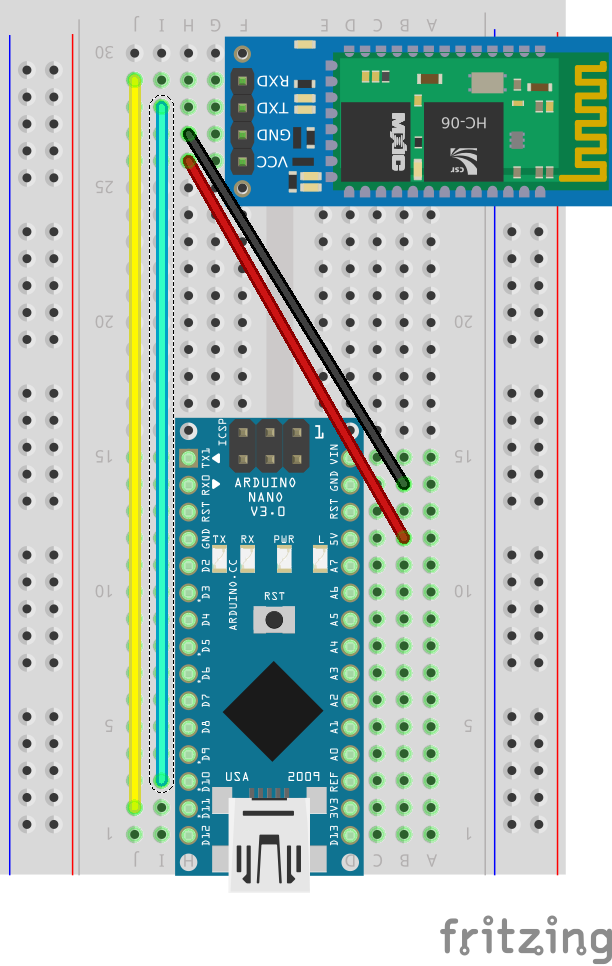
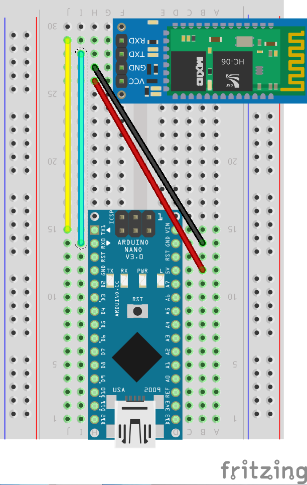
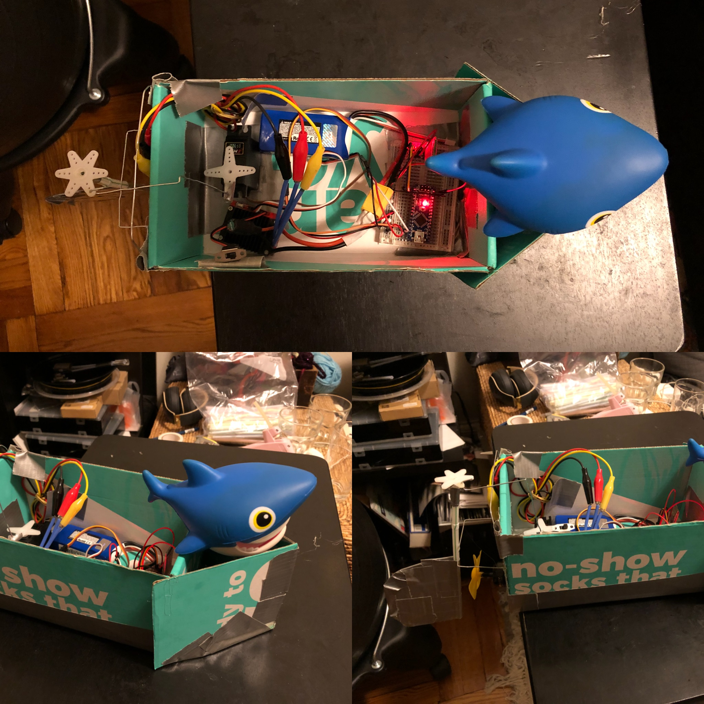
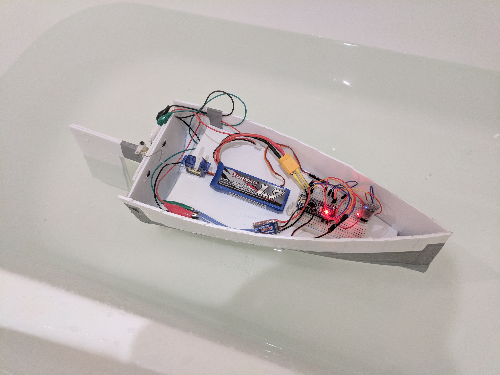

# Welcome to NodeBoats at JS Conf 2018!

### Getting Started

As part of this workshop, you should divide up into teams of 3-4 people. Try to find people with a similar boat "vision" as you to partner with.

Teams will be building a motor-propelled boat, which will require some soldering. Feel free to ask any of the workshop team members if you need help with any part of this process.

Each boat kit will include the following materials. Make sure you let us know if any components are missing! (Please also keep in mind that we do need the parts back at the end of the day!)

#### Boat Kits

- Arduino Nano
- Electronic Speed Controller (ESC) 30A with Reverse
- Micro Servo
- HC-06 Bluetooth Module
- 2S Lipo Battery with XT60 connector
- 2S USB Lipo Charger
- Breadboard
- USB A <-> Mini-B USB cable
- Jumper Wires (Male-to-Male && Female-to-Male)
- Wire Extension
- Brushless Motor
- Propellor
- L-shaped connector
- Boat Hull (aka Plastic Takeout Boxes)

#### Things you may need (And We Have!!!)

- Goopy goo glue sealant
- Styrofoam (we have sheets and will cut off what your boat needs)
- Popsicle Sticks!
- Hot glue gun
- Soldering irons & solder
- Heat shrink tubing & heaters
- Wire cutters/strippers
- A drill
- Box cutters
- Googly eyes
- Feathers
- Mini Pool Floaties

### Configuring the Arduino Nano & HC-06 Bluetooth module

To avoid using extemely long USB cables to drive the boats from the water to your laptops, the HC-06 Bluetooth module will allow you to run Johnny-Five commands wirelessly to the Arduino Nano. The NodeBoats team has pre-configured the modules to do this, so the following instructions are useful if you are building the boat at home later or need to reconfigure the module. They are based on the [HC-05 configuration docs](https://github.com/rwaldron/johnny-five/wiki/Getting-Started-with-Johnny-Five-and-HC-05-Bluetooth-Serial-Port-Module) with some key changes for the HC-06 and this workshop.

**For the workshop, you can [skip to steps 4 and 5](https://github.com/opheliasdaisies/nodeboats-jsconf2018#step-4-wire-the-module-to-the-arduinos-hardware-port) to learn about pairing the pre-configured module with your laptop.**

#### Step 1: Connect the HC-05 module to the Arduino for configuration

We will program the Arduino to send AT commands to the module to configure it via a SoftwareSerial connection. Wire the TX (transmit) and RX (receive) pins of your module to your Arduino. They need to be wired in a crossover configuration, so from the module to the Arduino wire TX to pin 10 and RX to pin 11. (For the purpose of configuring the Bluetooth module, pin 10 is used as RX on the Arduino, and pin 11 is used as TX. Later, when running Johnny-Five code, we'll use the pins labeled TX and RX on the arduino.)



You will need the [Arduino IDE](https://www.arduino.cc/en/main/software) to upload the [configuration sketch file](/code/HC06-Config/HC06-Config.ino) to your Arduino. The sketch will create a connection between the Arduino's serial port and the HC-06, as well as configure the HC-06 to use the same [baudrate](https://en.wikipedia.org/wiki/Baud) as Johnny-Five.o

```c

  // Set ROBOT_NAME to something unique
  #define ROBOT_NAME "RandomBot"

  // If you haven't configured your device before use this
  #define BLUETOOTH_SPEED 9600 //This is the default baudrate that HC-06 uses
  // If you are modifying your existing configuration, use this:
  // #define BLUETOOTH_SPEED 57600

  #include <SoftwareSerial.h>

  // Swap RX/TX connections on bluetooth chip
  //   Pin 10 --> Bluetooth TX
  //   Pin 11 --> Bluetooth RX
  SoftwareSerial mySerial(10, 11); // RX, TX

  /*
    The possible baudrates are:
      AT+UART=1200,0,0 -------1200
      AT+UART=2400,0,0 -------2400
      AT+UART=4800,0,0 -------4800
      AT+UART=9600,0,0 -------9600 - Default for hc-06
      AT+UART=19200,0,0 ------19200
      AT+UART=38400,0,0 ------38400
      AT+UART=57600,0,0 ------57600 - Johnny-five speed
      AT+UART=115200,0,0 -----115200
      AT+UART=230400,0,0 -----230400
      AT+UART=460800,0,0 -----460800
      AT+UART=921600,0,0 -----921600
      AT+UART=1382400,0,0 ----1382400
  */

  void setup() {
    Serial.begin(9600);

    Serial.println("Starting config");
    mySerial.begin(BLUETOOTH_SPEED);
    delay(1000);

    // Should respond with OK
    mySerial.print("AT\r\n");
    waitForResponse();

    // Should respond with its version
    mySerial.print("AT+VERSION\r\n");
    waitForResponse();

    // Should respond with default password, probably 1234
    mySerial.print("AT+PSWD\r\n");
    waitForResponse();

    // Set the name to ROBOT_NAME
    String rnc = String("AT+NAME=") + String(ROBOT_NAME) + String("\r\n"); 
    mySerial.print(rnc);
    waitForResponse();

    // Set baudrate to 57600
    mySerial.print("AT+UART=57600,0,0\r\n");
    waitForResponse();

    Serial.println("Done!");
  }

  void waitForResponse() {
      delay(1000);
      while (mySerial.available()) {
        Serial.write(mySerial.read());
      }
      Serial.write("\n");
  }

  void loop() {}

```

#### Step 2: Check configuration

The setup() function will take about 6 seconds to run. You can connect to the Arduino with Serial Monitor and you should see the following output.

```

  Starting config
  OK
  OK[VERSION]
  OK[PSWD]
  OK
  OK
  Done!

```

If you saw that, congratulations! You're done with this step.

If you see the following output instead, you will probably have to change BLUETOOTH_SPEED to another value and upload it again. This could be because the HC-06 chip had a different baud rate.

```

  Starting config


  Done!

```

If you are having trouble uploading the firmata firmware to the device, make sure that nothing is connected to pins 0 and 1 when uploading, as this can interfere with the upload process.


#### Step 3: Re-upload StandardFirmataPlus

Once the baud rate is properly set, re-upload the StandardFirmataPlus sketch to your board. If you don't do this it might seem that your bluetooth module is getting a connection and the light will stop blinking, but you won't be able to connect.

You can upload StandardFirmataPlus through the [Arduino IDE](https://www.instructables.com/id/Arduino-Installing-Standard-Firmata/) or using [firmata-party](https://www.npmjs.com/package/firmata-party) from the command line.

#### Step 4: Wire the module to the Arduino's hardware port

Once the baud rate is properly set & Firmata reloaded, which has already been done for you for the workshop, connect the TX and RX pins to Arduino pins RX0 and TX1 respectively.



#### Step 5: Pair the module

Pair to the module from your host device. Once you have paired with your bluetooth device the serial port should be visible with the 'ROBOT_NAME' used in Step 1. (If you're in the workshop at JS Conf, the 'ROBOT_NAME' will be labeled on your module when you receive it, and the pin code will be 1234.) It will be something like /dev/tty.ROBOT_NAME-SPPDev (in UNIX) and use COMX in Windows (where X is the number of the port). Use this name to tell [Johnny-Five which port to use](http://johnny-five.io/api/board/#component-initialization).

You can test the connection by modifying the `blink.js` program to add the path to the Bluetooth port and running the program. Make sure Johnny-Five is installed in the `code` directory (`npm install`) before running `node code/blink.js`. 

### Resources for Building Your Boat!

You may need some help while setting up your NodeBoat. Here are some tips and tricks so you can learn from our experiences:

- Check out the [build guide](./build.md) to see wiring examples and tips for working with the ESC and servo.
- The [Arduino Nano pinout](http://www.circuitstoday.com/arduino-nano-tutorial-pinout-schematics) is a handy reference for what each pin can do
- The name of the Bluetooth module should be on its bag, look for this when pairing it with your laptop
- Connect the ground (GND) wire before connecting the power wire, especially when working with the lipo battery.
- Unplugging or turning off power when switching wires is good practice to avoid unexpected short circuits.

First Time Using Johnny-Five? Don't hesitate to ask us for help! That's why we're here. Here are some intro materials and parts of the docs that will be particularly helpful while building your boats:

- [Board class API](http://johnny-five.io/api/board/#component-initialization)
- [ESC class API](http://johnny-five.io/api/esc/)
- [Servo class API](http://johnny-five.io/api/servo/)
- [Controlling Johnny-Five with `keypress`](https://gist.github.com/goldsamantha/1fd9ba71c398e8a06fd319cac05cf022)
- [Controlling Johnny-Five with Express & Socket.io](https://learn.sparkfun.com/tutorials/reconbot-with-the-tessel-2)

### Examples

These are a few examples of boats that the Nodeboats Team has built to show the variety of design and creativity that can go into creating your vessel.




